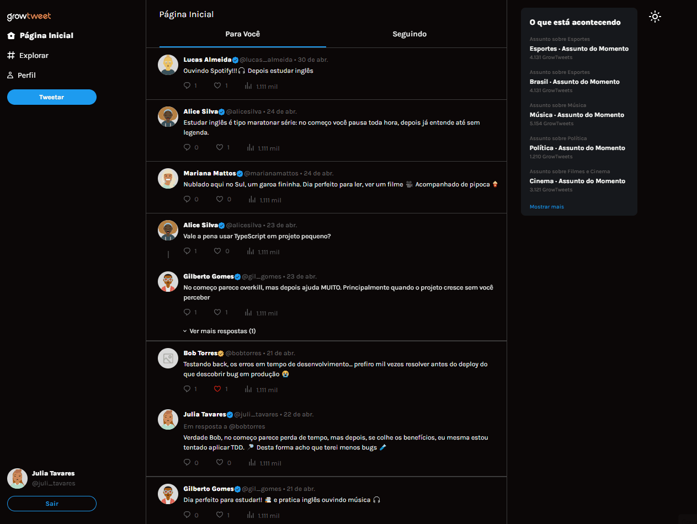
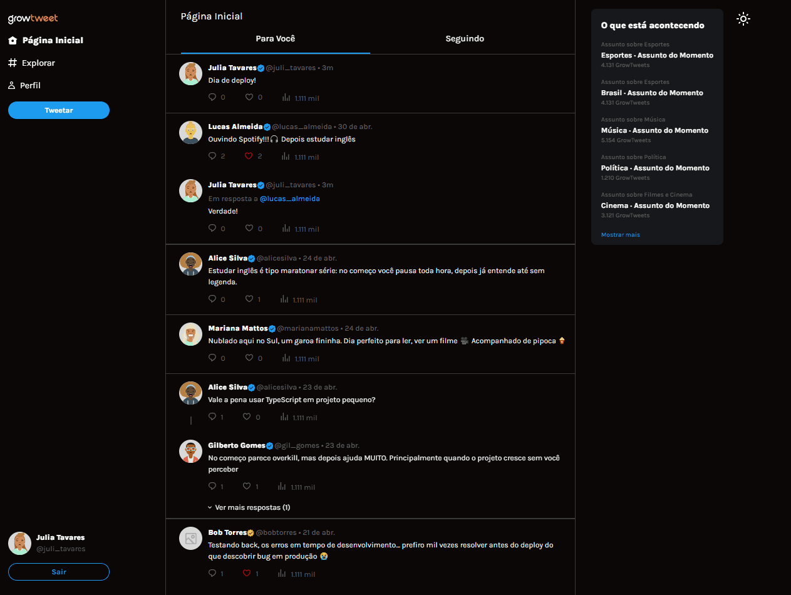
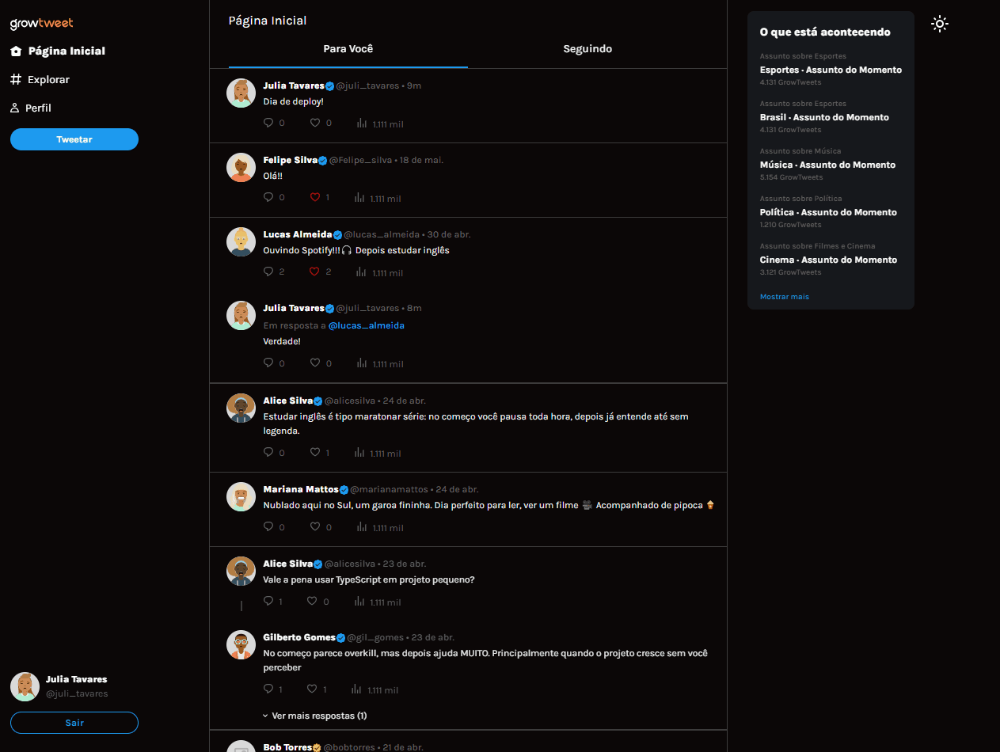
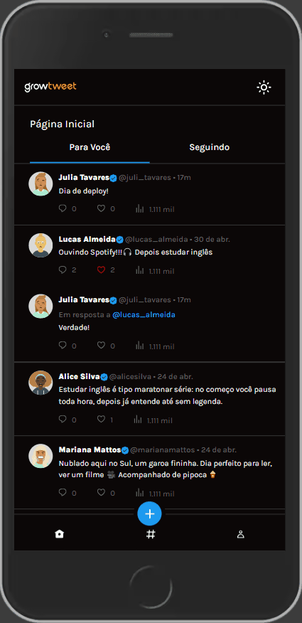

# 🐦 Growtwitter

A modern Twitter-like social media application built with React, TypeScript and a REST API.

## 📸 Application Preview

### 🏠 Feed Page

### 🔎 Explorer Page

### 👤 Profile Page

### 📱 Mobile

## ⚙️ Tech Stack

- React 19
- TypeScript
- Vite
- Redux Toolkit
- Material UI
- React Router DOM
- Jest
- Cypress

## 🏗️ Architecture

- Feature-based structure
- React + TypeScript + Vite
- Redux Toolkit for state management
- REST API integration
- Jest for unit and integration tests
- Cypress for end-to-end testing of user flows

## 🧠 About the Project

Growtwitter is a social media frontend application inspired by Twitter (X), where user interactions dynamically shape the entire content experience.

The application simulates real-world social behavior such as:

- following users
- liking tweets
- replying in threaded conversations
- consuming personalized feeds

## 🎯 Key Features

- 🔐 Authentication system (login/logout)
- 🏠 Dynamic feed based on follow relationships
- 🔁 Threaded replies with expand/collapse behavior
- 🔎 Explorer page with user suggestions
- 👤 Profile page with contextual tabs
- ❤️ Like system with contextual rendering
- 🌗 Light/Dark theme support

## 🏠 Feed Page

The Feed Page displays tweets based on the logged-in user's relationships.

### 📌 Feed Content Rules

- Tweets from users the current user follows
- Tweets from the logged-in user

### 🔹 Tab: For You

Displays tweets organized by conversation context.

Tweet Types:

- Simple parent tweet
- Tweet with a single reply
  - Displays: Replying to @username
- Threaded tweets (multiple replies)
  - Nested structure
  - No “Replying to” label
  - Expand/collapse replies:
    - “View more replies”
    - “Hide replies”

### 🔹 Tab: Following

Displays a timeline filtered by following relationships.

Rules:

- Only parent tweets
- Only from users the current user follows
- Excludes the user's own tweets
- Replies are not shown as main feed items

## 🔎 Explorer Page

A discovery page for new users.

Rules:

- Shows only users NOT followed by the logged-in user
- List is dynamically updated

## 👤 Profile Page

The Profile Page supports two contexts:

- Logged-in user profile
- Visited user profile

🔹 Tabs:

### 📝 Tweets

- Shows only parent tweets
- Replies are excluded

### 💬 Replies

- Shows only replies where the user participates
- Includes conversation context
- Threaded replies are displayed with indentation

### 🖼️ Media

- Static content layout

### ❤️ Likes

- Shows only liked parent tweets
  - If a liked tweet is a reply:
    - shows context: Replying to @username

## 🧪 Testing

The project includes unit and end-to-end tests with Jest and Cypress, covering:

- authentication flows
- feed rendering
- tweet creation and replies
- thread expansion/collapse
- profile navigation
- explorer user interaction

## 🚀 Deployment

Add Vercel link here

## 👨‍💻 Author

Developed by Iara Tassi
